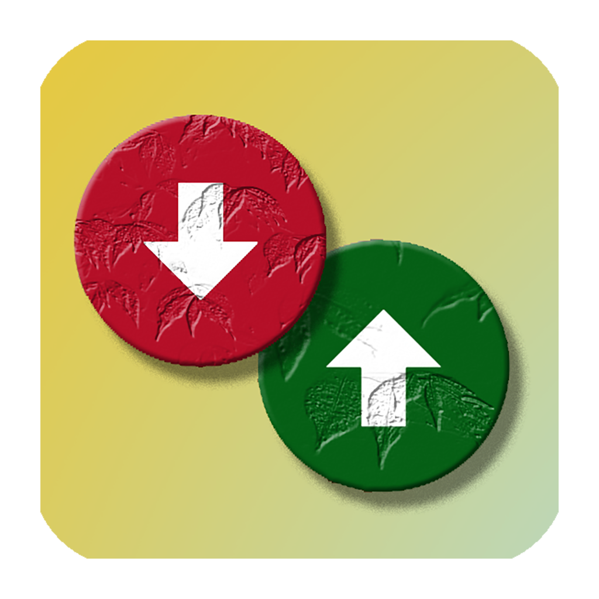
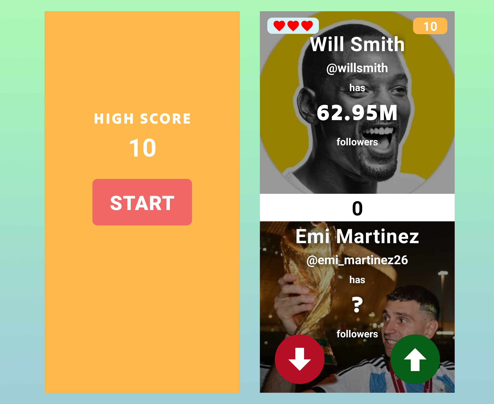
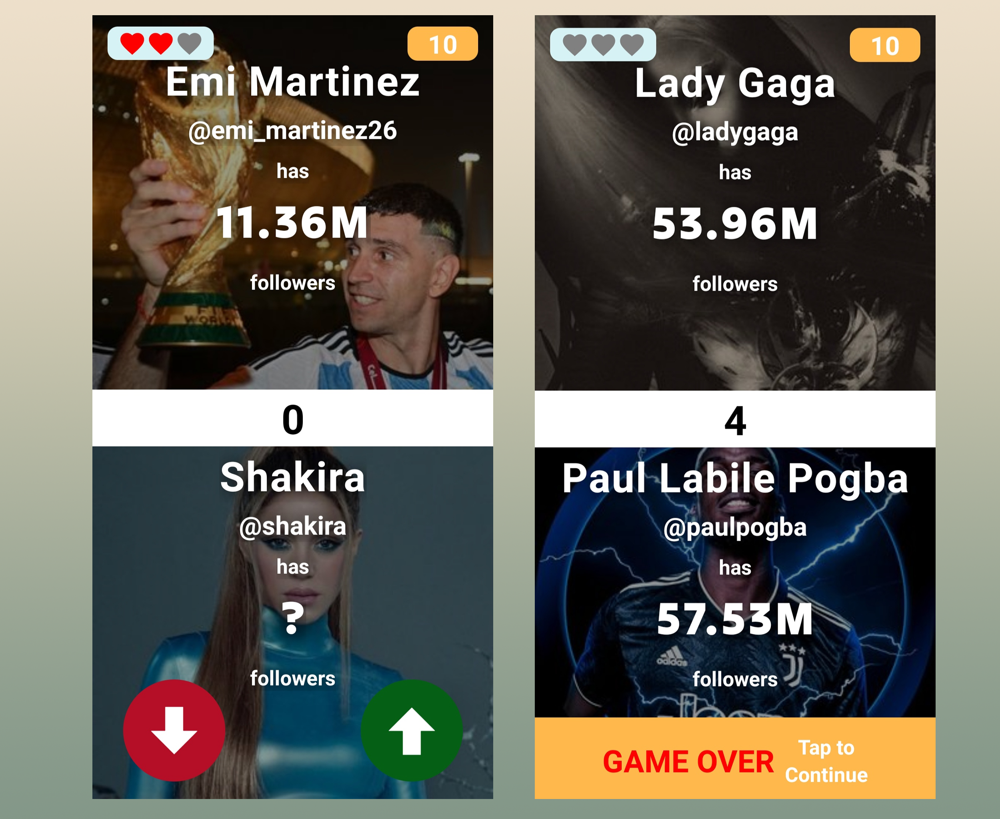

  

# Follower Frenzy - Mobile App 📱

Follower Frenzy is a fun mobile app made using React Native where users can guess the follower count of popular handles on social media in comparison to a given handle's follower count. If the user guesses correctly, the follower count of the guessed handle will be revealed, and a new handle will be added with the same question. It is the instagram version of the famous [Higher Lower](http://www.higherlowergame.com/) game.

## 🚀 Getting started

To get started with Trackit, you'll need to have React Native installed on your machine. You can follow the [official React Native documentation](https://reactnative.dev/docs/environment-setup) to set up your development environment.

Once you have React Native set up, you can clone this repository and install the required dependencies by running:

`npm install`

You can then start the app on your preferred platform by running:

`npm run ios`

or

`npm run android`

depending on whether you want to run the app on an iOS or Android simulator.

## 🎁 Features

- Guess the follower count of popular handles on social media
- View the follower count and profile picture of the next handle and continue playing
- High score 🏆 feature that persists across sessions using async storage
- Simple and intuitive user interface for easy gameplay

## 📷 Previews

  
https://user-images.githubusercontent.com/65273165/224387326-38b3ff1c-5c60-4266-9649-f8d4141a3680.mp4
  
  
  

## 💻 Prerequisites

To build and run the app locally, you will need to have [Node.js](https://nodejs.org/) and `npm` or `yarn` installed on your machine. Additionally, you will need to have an Android emulator or an iOS simulator set up on your machine.

## 🕹️ Using the App

When you first open the app, you will be presented with a handle's follower count and two buttons, one labeled "Higher" and one labeled "Lower". Your task is to guess whether the follower count of the next handle will be higher or lower than the current handle's follower count.

If you guess correctly, the follower count and profile picture of the next handle will be revealed, and a new handle will be added with the same question. If you guess incorrectly, the game will end, and your score will be displayed along with the highest score achieved on your device.

## 🛠️ Built With

The app was built using [React Native](https://reactnative.dev/), a popular framework for building cross-platform mobile apps.

## 🤝 Contributing

If you find a bug or would like to suggest an improvement, feel free to open an issue or submit a pull request. All contributions are welcome! 🙌

## 📄 License

Trackit is released under the [MIT License](https://opensource.org/licenses/MIT). Feel free to modify or add to this list based on the specific features of your app. 📝
